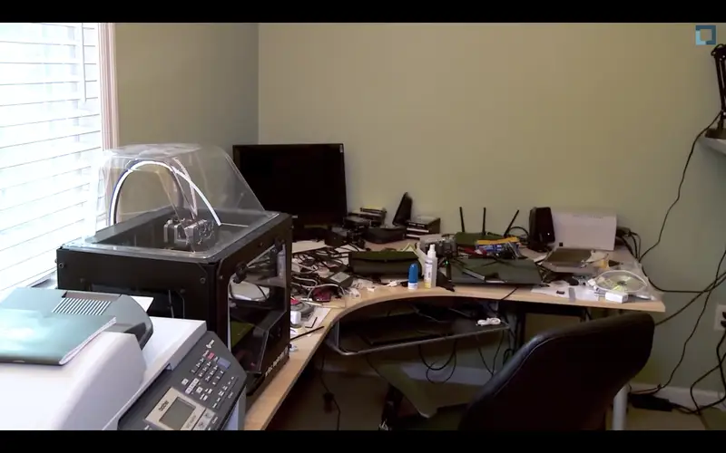

# dotfiles

> "I tried multiple times finding an editor that is more modern and does fancy
> things like colorize my source code..."
> — _Linus Torvalds_

> "Syntax highlighting is juvenile. When I was a child, I was taught that it's
> better to read, not to look at the pictures." — Rob Pike

[](https://github.com/torvalds/uemacs)



## Management

Managed entirely with [GNU Stow](https://www.gnu.org/software/stow/).

```bash
git clone [https://github.com/yourusername/dotfiles.git](https://github.com/yourusername/dotfiles.git) ~/dotfiles
cd ~/dotfiles
stow <package_name>
```
